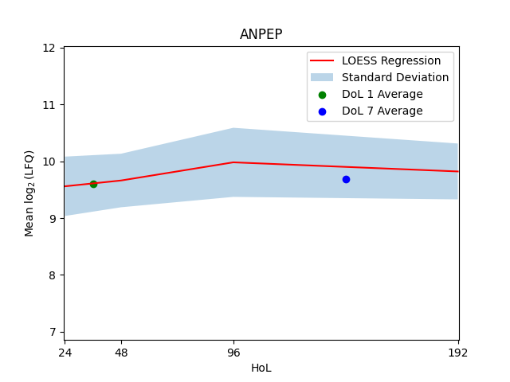
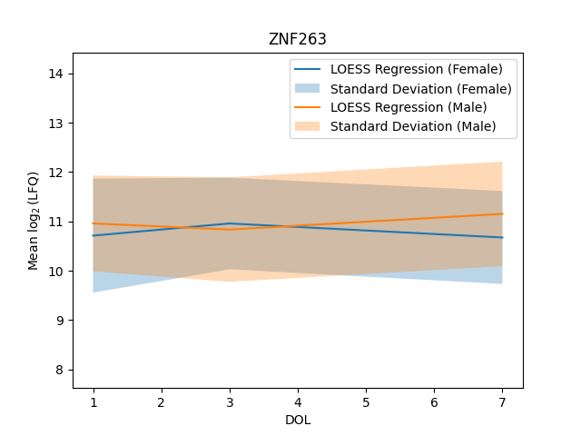
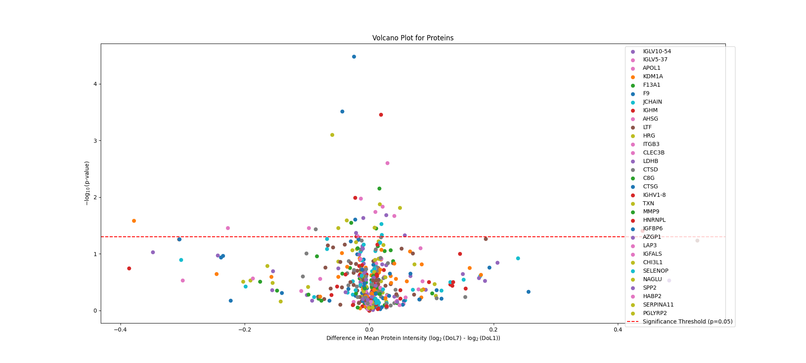

# ProtONT 
ProtONT is a tool designed to visualize LFQ (Label-Free Quantification) protein data within specific time intervals effectively. It allows for the creation of volcano plots, providing insights into whether changes in specific proteins within predetermined time points (HOL: hour of life and/or DOL: day of life) are significant. Additionally, it enables the generation of LOESS curves, illustrating the trajectory of protein data over certain time periods.

The tool offers the following features:

Log2 transformation of data
MinMax scaling of data for normalization
Creation of volcano plots and output of significant genes
Generation of LOESS plots for visualizing temporal trends
Generation of LOESS plots with two factors to highlight differences (e.g., grouping changes based on gender over time)
Calculation of significance between temporal changes for two factors
Selection of specific time intervals

ProtONT (Protein Ontogeny) can be utilized to visualize the ontogeny of proteins.

## 1. Installation using Conda

To install ProtONT, you need to have Python 3.9 or newer installed on your system.

### 1.1 Create and Activate a Conda Environment

Create a Conda environment and activate it:

```bash
conda create -n ProtONT
conda activate ProtONT
```

### 1.2 Install with Git (Recommended)

Clone this repository with git clone https://github.com/Katuraschek/ProtONT.git and navigate there to install it in the newly created Conda environment (use -e for editable):

```bash
pip install -e .
```

After updates on GitHub, you can use the newest version of the code by running git pull in the cloned directory.

### 1.3 Install without Git

Install directly from GitHub with:

```bash
pip install git+https://github.com/Katuraschek/ProtONT.git#egg=ProtONT
```

You can verify that ProtONT was installed by using conda list. To incorporate the newest changes from GitHub, you can run:

```bash
pip install -U --force-reinstall git+https://github.com/Katuraschek/ProtONT.git#egg=ProtONT
```

This is less convenient as you have to reinstall the entire package from the Conda prompt each time.

### 1.4 Usage

You can use the package from your Conda environment, e.g., to run the example notebook demonotebook.ipynb. To run Jupyter Notebooks, you can install Jupyter in your environment using:

```bash
conda install jupyter
```

#### 4.1 Data Input
You can find example input in the folder example_input. Use the exact format and structure of the provided CSV and TSV files. 

##### 4.1.1 meta.csv
Use the meta.csv file to input your metadata. All headers starting with 'METAinfoX' can be customized according to your specific input. Other headers must remain unchanged. HOL (Hour of Life) requires specific hour int-values. DOL (Day of Life) requires exact int number of days. Keep 'RandomizationGroup' as a column, as it will be used for merging purposes. The column 'SampleIDalt2' should contain the names of the samples as provided in your protein file. Do not change the number of metadatacolumns.

##### 4.1.2 report.pg_matrix.tsv
This TSV file represents a typical output from protein sequencing. Maintain the structure of the TSV as demonstrated in this example file. The first five columns are reserved for general information. Ensure that the column 'Genes' is retained, as all calculations will reference the changes in LFQ from those chosen genes. Starting from the sixth column, the LFQ values of your samples are provided. You can add as many samples as necessary.

##### 4.1.3 input.csv
This file is a merged file from report.pg.matrix.tsv and meta.csv. The merging is based on the Sample names, which are provided in the headers of report.pg.matrix.tsv starting from the sixth column and in the column 'SampleIDalt2' of meta.csv. Ensure the correct Sample name is used. The code can match the Sample name from the metadata to the header of the protein file (e.g., if the Sample name in the metadata is 'Sample1' and in the protein file is 'C:/User/input/Sample1/output'). However, even small changes in the Sample names will affect the merging outcome ('Sample-1' and 'Sample_1' will not be merged). 

#### 4.2 Output

#### 4.2.1 LOESS curves for DOL change
This is an example for a LOESS curve output for the gene's 'ANPEP' ontogeny, plotted over a period of 192 hours.


#### 4.2.2 LOESS curves for two factored DOL change
This is an example for a LOESS curve output for the gene's 'ZNF263' ontogeny, plotted over a period of 7 days, when grouped into male and female groups for a second factor.


#### 4.2.3 Volcano plot for all genes
This is an example for a volcano plot, showing the ontogeny differences of all genes and their p-value for significance. 


### Contact

For questions and suggestions, please contact Katharina.Juraschek@childrens.harvard.edu.

Please use the "Issues" section for bug reports and feature requests.
